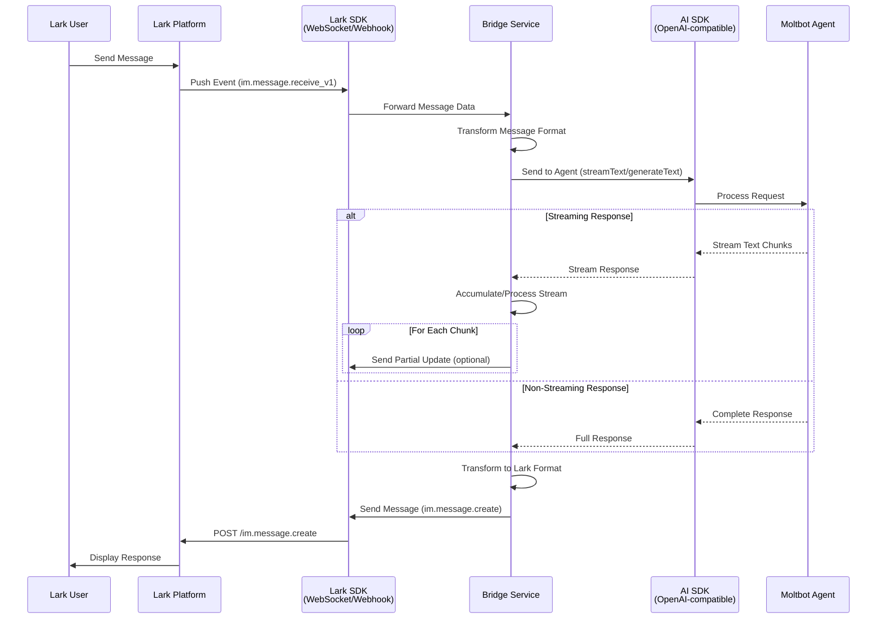

# Moltbot with Lark - Architecture Plan (Updated)

## Project Overview

Create a TypeScript Node.js project that bridges Lark (飞书) long connections to moltbot's agent using:

- Lark SDK: `@larksuiteoapi/node-sdk`
- Moltbot SDK: `@ai-sdk/openai-compatible`
- Configuration: Environment-based JSON file reading

## SDK Documentation Research Results

### Lark SDK (@larksuiteoapi/node-sdk)

**Key Features Discovered:**

- **Two connection modes**:
  1. **Webhook mode**: HTTP server receiving events via POST requests
  2. **WebSocket (Long Connection) mode**: Real-time bidirectional connection using `WSClient`

- **Event Handling**: `EventDispatcher` for registering event handlers
  - Key event: `im.message.receive_v1` for receiving messages
  - Supports message cards, interactive actions via `CardActionHandler`

- **Message Sending**: `Client` API for sending messages back to Lark
  - Supports text, interactive cards, rich text
  - Methods: `im.message.create()` with params and data

**Code Examples:**

```typescript
// Webhook mode with Express
import * as lark from "@larksuiteoapi/node-sdk";
import express from "express";

const client = new lark.Client({
  appId: "app id",
  appSecret: "app secret",
});

const eventDispatcher = new lark.EventDispatcher({
  encryptKey: "encryptKey",
}).register({
  "im.message.receive_v1": async (data) => {
    const chatId = data.message.chat_id;
    // Process message and send to Moltbot
  },
});

const server = express();
server.use("/webhook/event", lark.adaptExpress(eventDispatcher));
server.listen(3000);
```

```typescript
// WebSocket (Long Connection) mode
import * as Lark from "@larksuiteoapi/node-sdk";

const client = new Lark.Client({
  appId: "xxx",
  appSecret: "xxx",
});

const wsClient = new Lark.WSClient({
  appId: "xxx",
  appSecret: "xxx",
  loggerLevel: Lark.LoggerLevel.info,
});

wsClient.start({
  eventDispatcher: new Lark.EventDispatcher({}).register({
    "im.message.receive_v1": async (data) => {
      // Handle incoming message
    },
  }),
});
```

### AI SDK (@ai-sdk/openai-compatible)

**Key Features Discovered:**

- **OpenAI-compatible provider**: `createOpenAICompatible()` for custom endpoints
- **Two response modes**:
  1. **generateText**: Non-streaming, complete response
  2. **streamText**: Streaming responses for real-time delivery

- **Unified API**: Consistent interface across different LLM providers
- **Message format**: Supports chat messages with system prompts

**Code Examples:**

```typescript
// Non-streaming response
import { createOpenAICompatible } from "@ai-sdk/openai-compatible";
import { generateText } from "ai";

const { text } = await generateText({
  model: createOpenAICompatible({
    baseURL: "https://api.example.com/v1",
    name: "example",
    apiKey: process.env.MY_API_KEY,
  }).chatModel("meta-llama/Llama-3-70b-chat-hf"),
  prompt: "Write a vegetarian lasagna recipe.",
});
```

```typescript
// Streaming response
import { createOpenAICompatible } from "@ai-sdk/openai-compatible";
import { streamText } from "ai";

const result = await streamText({
  model: createOpenAICompatible({
    baseURL: "https://api.example.com/v1",
    name: "example",
    apiKey: process.env.MY_API_KEY,
  }).chatModel("meta-llama/Llama-3-70b-chat-hf"),
  prompt: "Tell me a story.",
});

// Stream text chunks
for await (const textChunk of result.textStream) {
  console.log(textChunk);
}
```

## Communication Architecture

### High-Level Flow

```
Lark Platform → Lark SDK → Message Handler → Moltbot SDK → Moltbot Agent
                      ↑                                      ↓
                      └─────── Response Handler ←────────────┘
```

### Communication Flow Diagram



## Proposed Communication Solution

### Option 1: WebSocket Long Connection (Recommended)

**Advantages:**

- Real-time bidirectional communication
- Lower latency than webhook polling
- Automatic reconnection handling
- Better for streaming responses

**Implementation:**

```typescript
import * as Lark from "@larksuiteoapi/node-sdk";
import { createOpenAICompatible } from "@ai-sdk/openai-compatible";
import { streamText } from "ai";

// Initialize Lark WebSocket client
const larkClient = new Lark.Client({
  appId: config.lark.appId,
  appSecret: config.lark.appSecret,
});

const wsClient = new Lark.WSClient({
  appId: config.lark.appId,
  appSecret: config.lark.appSecret,
  loggerLevel: Lark.LoggerLevel.info,
});

// Initialize Moltbot client
const moltbotProvider = createOpenAICompatible({
  baseURL: config.moltbot.apiEndpoint,
  name: "moltbot",
  apiKey: config.moltbot.apiKey,
});

// Start WebSocket connection
wsClient.start({
  eventDispatcher: new Lark.EventDispatcher({}).register({
    "im.message.receive_v1": async (data) => {
      // Extract message content
      const { chat_id, content } = data.message;
      const messageText = JSON.parse(content).text;

      // Send to Moltbot with streaming
      const result = await streamText({
        model: moltbotProvider.chatModel(config.moltbot.modelName),
        prompt: messageText,
      });

      // Accumulate streaming response
      let fullResponse = "";
      for await (const chunk of result.textStream) {
        fullResponse += chunk;
      }

      // Send back to Lark
      await larkClient.im.message.create({
        params: { receive_id_type: "chat_id" },
        data: {
          receive_id: chat_id,
          content: JSON.stringify({ text: fullResponse }),
          msg_type: "text",
        },
      });
    },
  }),
});
```

### Option 2: Webhook Mode

**Advantages:**

- Simpler deployment (no WebSocket server needed)
- Works with any HTTP server
- Easier to debug and test
- Better for serverless deployments

**Implementation:**

```typescript
import * as lark from "@larksuiteoapi/node-sdk";
import express from "express";
import { createOpenAICompatible } from "@ai-sdk/openai-compatible";
import { generateText } from "ai";

const app = express();
app.use(express.json());

// Initialize Lark client
const larkClient = new lark.Client({
  appId: config.lark.appId,
  appSecret: config.lark.appSecret,
});

// Initialize Moltbot client
const moltbotProvider = createOpenAICompatible({
  baseURL: config.moltbot.apiEndpoint,
  name: "moltbot",
  apiKey: config.moltbot.apiKey,
});

// Setup event dispatcher
const eventDispatcher = new lark.EventDispatcher({
  encryptKey: config.lark.encryptKey,
}).register({
  "im.message.receive_v1": async (data) => {
    const { chat_id, content } = data.message;
    const messageText = JSON.parse(content).text;

    // Send to Moltbot (non-streaming for webhook)
    const { text } = await generateText({
      model: moltbotProvider.chatModel(config.moltbot.modelName),
      prompt: messageText,
    });

    // Send back to Lark
    await larkClient.im.message.create({
      params: { receive_id_type: "chat_id" },
      data: {
        receive_id: chat_id,
        content: JSON.stringify({ text }),
        msg_type: "text",
      },
    });
  },
});

// Mount webhook endpoint
app.use("/webhook/event", lark.adaptExpress(eventDispatcher));
app.listen(config.server.port);
```

## Clarifying Questions (To Be Answered)

### 1. Lark Connection Mode

**Question:** Which Lark connection mode do you prefer?

- WebSocket Long Connection (recommended for real-time)
- Webhook (simpler, works with any HTTP server)
- Both (support both modes with configuration)

### 2. Moltbot Response Mode

**Question:** How should Moltbot responses be handled?

- Non-streaming (wait for complete response before sending to Lark)
- Streaming (send partial updates to Lark as they arrive)
- Configurable (choose per request)

### 3. Message Transformation

**Question:** What message transformations are needed?

- Direct forwarding (no transformation)
- Add metadata (user info, conversation context)
- Format conversion (markdown, cards, rich text)
- Conversation history management

### 4. Configuration

**Question:** Configuration structure preference?

- Single JSON file with all settings
- Multiple JSON files (lark.json, moltbot.json, server.json)
- Environment variables + JSON files combination

### 5. Additional Features

**Question:** Do you need support for?

- Message cards and interactive elements
- File attachments and images
- Multiple conversations simultaneously
- Conversation history and context
- Error handling and retry logic
- Logging and monitoring

## Proposed Project Structure

```
moltbot-with-lark/
├── src/
│   ├── config/           # Configuration management
│   │   ├── index.ts      # Config loader and validator
│   │   └── schema.ts     # TypeScript interfaces
│   ├── lark/             # Lark integration
│   │   ├── client.ts     # Lark SDK client setup
│   │   ├── handlers.ts   # Event/message handlers
│   │   ├── websocket.ts  # WebSocket client (if needed)
│   │   └── types.ts      # Lark type definitions
│   ├── moltbot/          # Moltbot integration
│   │   ├── client.ts     # Moltbot SDK client setup
│   │   ├── handlers.ts   # Response handlers
│   │   └── types.ts      # Moltbot type definitions
│   ├── bridge/           # Bridge logic
│   │   ├── transformer.ts # Message transformation
│   │   ├── router.ts     # Routing logic
│   │   └── context.ts    # Conversation context management
│   ├── server/           # HTTP/WebSocket server
│   │   ├── index.ts      # Server setup
│   │   └── routes.ts     # API routes
│   ├── utils/            # Utility functions
│   │   ├── logger.ts     # Logging utility
│   │   └── errors.ts     # Error handling
│   └── index.ts          # Application entry point
├── config/               # Configuration files
│   ├── config.json       # Main configuration
│   └── config.example.json # Configuration template
├── tests/                # Test files
├── package.json
├── tsconfig.json
└── README.md
```

## Configuration Schema (Preliminary)

```json
{
  "lark": {
    "appId": "string",
    "appSecret": "string",
    "encryptKey": "string?",
    "verificationToken": "string?",
    "connectionMode": "websocket|webhook",
    "webhookUrl": "string?"
  },
  "moltbot": {
    "apiEndpoint": "string",
    "apiKey": "string",
    "modelName": "string",
    "temperature": "number?",
    "maxTokens": "number?",
    "streaming": "boolean"
  },
  "server": {
    "port": "number",
    "host": "string",
    "cors": {
      "enabled": "boolean",
      "origins": "string[]"
    }
  },
  "logging": {
    "level": "string",
    "format": "string",
    "output": "string[]"
  },
  "features": {
    "conversationHistory": "boolean",
    "messageCards": "boolean",
    "fileAttachments": "boolean"
  }
}
```

## Next Steps

1. **Answer clarifying questions** to refine requirements
2. **Choose connection mode** (WebSocket vs Webhook)
3. **Finalize architecture** based on answers
4. **Create detailed implementation plan** with specific tasks
5. **Review and approve** before implementation

---

**Note**: This plan is based on actual SDK documentation research. The implementation examples are ready to use and can be adapted based on your specific requirements.
