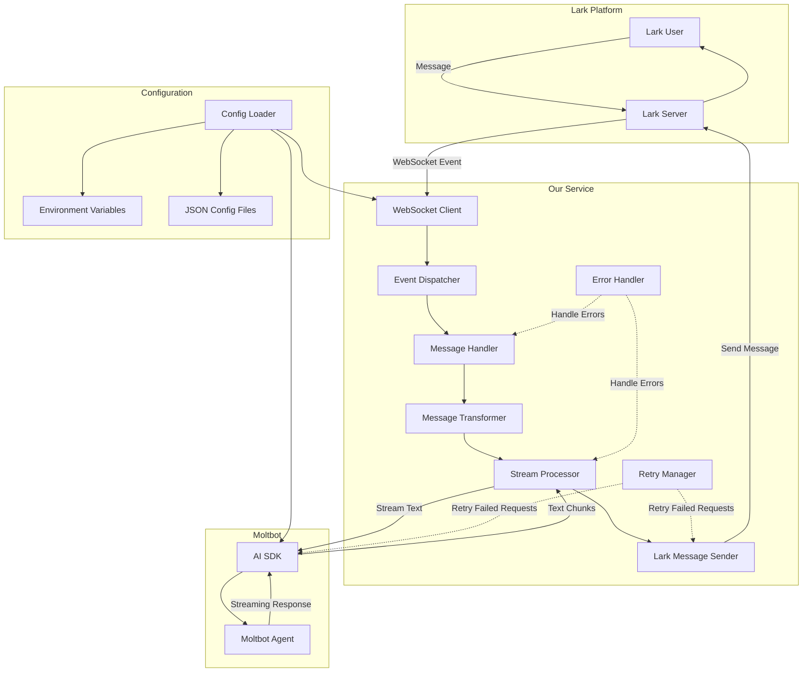

# Moltbot with Lark - Implementation Plan

## User Requirements Summary

Based on your selections, here's what we'll build:

### Core Requirements

1. **Lark Connection Mode**: WebSocket Long Connection (real-time)
2. **Moltbot Response Mode**: Streaming (send partial updates to Lark as they arrive)
3. **Message Transformation**: Format conversion (markdown, cards, rich text)
4. **Configuration**: Environment variables + JSON files combination
5. **Additional Features**:
   - Message cards and interactive elements
   - File attachments and images
   - Error handling and retry logic

## Architecture Overview



## Detailed Implementation Plan

### Phase 1: Project Setup and Configuration

#### Task 1.1: Initialize TypeScript Project

- Initialize npm project with `npm init`
- Install TypeScript and dependencies
- Configure `tsconfig.json`
- Set up ESLint and Prettier (optional but recommended)

**Dependencies to install:**

```json
{
  "dependencies": {
    "@larksuiteoapi/node-sdk": "^latest",
    "@ai-sdk/openai-compatible": "^latest",
    "ai": "^latest",
    "zod": "^latest",
    "winston": "^latest",
    "dotenv": "^latest"
  },
  "devDependencies": {
    "@types/node": "^latest",
    "typescript": "^latest",
    "ts-node": "^latest",
    "jest": "^latest",
    "@types/jest": "^latest",
    "ts-jest": "^latest"
  }
}
```

#### Task 1.2: Create Project Structure

Create the following directory structure:

```
moltbot-with-lark/
├── src/
│   ├── config/
│   │   ├── index.ts
│   │   ├── schema.ts
│   │   └── loader.ts
│   ├── lark/
│   │   ├── client.ts
│   │   ├── handlers.ts
│   │   ├── websocket.ts
│   │   ├── sender.ts
│   │   └── types.ts
│   ├── moltbot/
│   │   ├── client.ts
│   │   ├── streamer.ts
│   │   └── types.ts
│   ├── bridge/
│   │   ├── transformer.ts
│   │   ├── processor.ts
│   │   └── context.ts
│   ├── utils/
│   │   ├── logger.ts
│   │   ├── errors.ts
│   │   └── retry.ts
│   └── index.ts
├── config/
│   ├── config.example.json
│   └── .env.example
├── tests/
│   ├── unit/
│   └── integration/
├── package.json
├── tsconfig.json
└── README.md
```

#### Task 1.3: Implement Configuration Management

Create a configuration system that combines environment variables and JSON files.

**Key files to create:**

- `src/config/schema.ts` - Zod schemas for validation
- `src/config/loader.ts` - Load and merge env vars + JSON
- `src/config/index.ts` - Export configuration interface

**Configuration schema:**

```typescript
{
  lark: {
    appId: string;           // From env: LARK_APP_ID
    appSecret: string;       // From env: LARK_APP_SECRET
    encryptKey?: string;     // From env: LARK_ENCRYPT_KEY
    verificationToken?: string; // From env: LARK_VERIFICATION_TOKEN
    connectionMode: 'websocket'; // Fixed
  },
  moltbot: {
    apiEndpoint: string;     // From env: MOLTBOT_API_ENDPOINT
    apiKey: string;          // From env: MOLTBOT_API_KEY
    modelName: string;       // From config.json
    temperature?: number;    // From config.json
    maxTokens?: number;      // From config.json
    streaming: true;         // Fixed
  },
  server: {
    port: number;            // From env: PORT or config.json
    host: string;            // From config.json
  },
  features: {
    messageCards: true;      // Fixed
    fileAttachments: true;   // Fixed
    errorHandling: true;     // Fixed
    retryLogic: true;        // Fixed
  },
  logging: {
    level: string;           // From env: LOG_LEVEL or config.json
    format: string;          // From config.json
  }
}
```

### Phase 2: Lark Integration

#### Task 2.1: Implement Lark WebSocket Client

Create `src/lark/websocket.ts`:

- Initialize `Lark.WSClient` with configuration
- Set up event dispatcher for `im.message.receive_v1`
- Handle connection lifecycle (connect, disconnect, reconnect)
- Implement error handling for WebSocket issues

#### Task 2.2: Create Lark Message Handler

Create `src/lark/handlers.ts`:

- Parse incoming Lark messages
- Extract message content (text, images, files)
- Handle different message types (text, image, file, card)
- Pass messages to bridge layer

#### Task 2.3: Implement Lark Message Sender

Create `src/lark/sender.ts`:

- Send text messages to Lark
- Send interactive cards to Lark
- Send file attachments to Lark
- Implement retry logic for failed sends
- Handle streaming updates (send partial responses)

#### Task 2.4: Define Lark Types

Create `src/lark/types.ts`:

- TypeScript interfaces for Lark message structures
- Types for different message formats (text, card, image, file)
- Event types and payloads

### Phase 3: Moltbot Integration

#### Task 3.1: Implement Moltbot Client

Create `src/moltbot/client.ts`:

- Initialize `createOpenAICompatible` provider
- Configure with API endpoint and key
- Set up model configuration

#### Task 3.2: Implement Streaming Response Handler

Create `src/moltbot/streamer.ts`:

- Use `streamText` from AI SDK
- Process streaming text chunks
- Accumulate full response
- Handle stream errors
- Support cancellation if needed

#### Task 3.3: Define Moltbot Types

Create `src/moltbot/types.ts`:

- TypeScript interfaces for Moltbot requests/responses
- Stream chunk types
- Configuration types

### Phase 4: Bridge Layer

#### Task 4.1: Implement Message Transformer

Create `src/bridge/transformer.ts`:

- Transform Lark messages to Moltbot format
- Convert Lark text/markdown to appropriate format
- Handle file attachments (extract URLs, metadata)
- Transform Moltbot responses to Lark format
- Convert markdown to Lark rich text or cards

**Transformation logic:**

```typescript
// Lark → Moltbot
- Extract text content from Lark message
- Include attachment URLs as context
- Format as prompt for Moltbot

// Moltbot → Lark
- Convert markdown to Lark rich text
- Create interactive cards for structured data
- Handle code blocks, lists, links
- Format streaming chunks appropriately
```

#### Task 4.2: Implement Stream Processor

Create `src/bridge/processor.ts`:

- Process streaming responses from Moltbot
- Accumulate chunks for full response
- Send partial updates to Lark (optional, for UX)
- Handle stream completion
- Manage conversation state

#### Task 4.3: Implement Conversation Context Manager

Create `src/bridge/context.ts`:

- Store conversation history (optional, can be added later)
- Maintain message context per chat
- Support multiple simultaneous conversations
- Clean up old conversations

### Phase 5: Error Handling and Retry Logic

#### Task 5.1: Implement Error Handler

Create `src/utils/errors.ts`:

- Define custom error types (LarkError, MoltbotError, BridgeError)
- Implement error classification (transient, permanent)
- Create error logging utility
- Implement error recovery strategies

#### Task 5.2: Implement Retry Manager

Create `src/utils/retry.ts`:

- Implement exponential backoff
- Configure retry limits per operation type
- Track failed operations
- Implement circuit breaker pattern (optional)

### Phase 6: Logging and Monitoring

#### Task 6.1: Implement Logger

Create `src/utils/logger.ts`:

- Set up Winston logger
- Configure log levels (error, warn, info, debug)
- Support structured logging
- Add request/response logging
- Log streaming events

#### Task 6.2: Add Health Checks

- Implement health check endpoint
- Monitor WebSocket connection status
- Monitor Moltbot API availability
- Log system metrics

### Phase 7: Main Application

#### Task 7.1: Create Entry Point

Create `src/index.ts`:

- Load configuration
- Initialize all components
- Start WebSocket client
- Set up graceful shutdown
- Handle process signals (SIGTERM, SIGINT)

#### Task 7.2: Add CLI/Startup Scripts

- Create npm scripts for development and production
- Add start script with proper error handling

### Phase 8: Testing

#### Task 8.1: Unit Tests

- Test configuration loading and validation
- Test message transformers
- Test error handling
- Test retry logic

#### Task 8.2: Integration Tests

- Test end-to-end message flow
- Test WebSocket connection
- Test Moltbot integration
- Test error scenarios

## Implementation Order

### Priority 1: Core Functionality

1. Project setup and configuration
2. Lark WebSocket client
3. Moltbot client with streaming
4. Basic message bridge (text only)
5. Basic error handling

### Priority 2: Enhanced Features

6. Message transformation (markdown, cards)
7. Streaming updates to Lark
8. File attachment support
9. Retry logic

### Priority 3: Production Readiness

10. Comprehensive logging
11. Health checks
12. Unit tests
13. Integration tests
14. Documentation

## Key Implementation Details

### WebSocket Connection Management

```typescript
// Auto-reconnect logic
- Implement exponential backoff for reconnection
- Handle connection state changes
- Log connection events
- Gracefully handle disconnections
```

### Streaming Response Handling

```typescript
// Send partial updates to Lark
- Accumulate chunks until a threshold (e.g., 100 chars or 1 second)
- Send partial updates to Lark
- Update the same message or send new messages
- Handle user interruptions
```

### Message Card Support

```typescript
// Convert markdown to interactive cards
- Parse markdown structure
- Create card elements (header, sections, actions)
- Handle code blocks, lists, links
- Support card updates
```

### File Attachment Handling

```typescript
// Process file attachments
- Extract file URLs from Lark messages
- Download or proxy files (optional)
- Include file metadata in Moltbot prompt
- Handle file size limits
```

### Error Handling Strategy

```typescript
// Error classification
- Transient errors: network issues, temporary failures (retry)
- Permanent errors: authentication, configuration (log and notify)
- User errors: invalid input (send error message to user)

// Retry configuration
- Lark API: 3 retries with exponential backoff
- Moltbot API: 3 retries with exponential backoff
- WebSocket: Auto-reconnect with backoff
```

## Configuration Files

### config/config.example.json

```json
{
  "lark": {
    "connectionMode": "websocket"
  },
  "moltbot": {
    "modelName": "gpt-4",
    "temperature": 0.7,
    "maxTokens": 2000,
    "streaming": true
  },
  "server": {
    "port": 3000,
    "host": "0.0.0.0"
  },
  "features": {
    "messageCards": true,
    "fileAttachments": true,
    "errorHandling": true,
    "retryLogic": true
  },
  "logging": {
    "level": "info",
    "format": "json"
  }
}
```

### config/.env.example

```bash
# Lark Configuration
LARK_APP_ID=your_app_id
LARK_APP_SECRET=your_app_secret
LARK_ENCRYPT_KEY=your_encrypt_key
LARK_VERIFICATION_TOKEN=your_verification_token

# Moltbot Configuration
MOLTBOT_API_ENDPOINT=https://api.moltbot.com/v1
MOLTBOT_API_KEY=your_api_key

# Server Configuration
PORT=3000

# Logging Configuration
LOG_LEVEL=info
```

## Success Criteria

The implementation is complete when:

1. ✅ WebSocket connection to Lark is established and maintained
2. ✅ Messages from Lark are received and processed
3. ✅ Messages are sent to Moltbot with streaming enabled
4. ✅ Streaming responses from Moltbot are processed
5. ✅ Responses are sent back to Lark in appropriate format
6. ✅ Message cards and rich text are supported
7. ✅ File attachments are handled
8. ✅ Errors are caught and logged appropriately
9. ✅ Failed requests are retried with backoff
10. ✅ Application can be started and stopped gracefully

## Next Steps

Once you approve this plan, I'll switch to Code mode to implement the solution following this detailed plan. The implementation will be done in the priority order specified, with core functionality completed first, followed by enhanced features and production readiness.

---

**Please review this plan and let me know if you'd like any changes or have questions before we proceed to implementation.**
